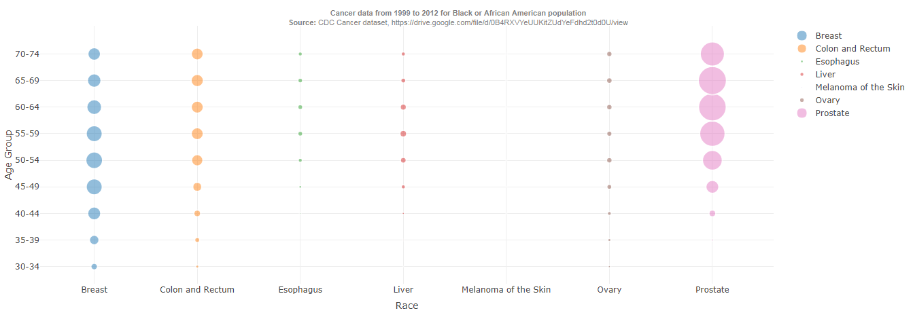
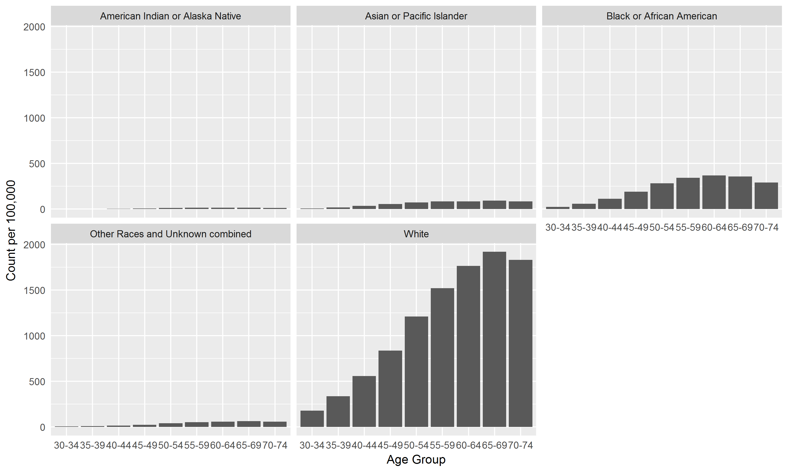
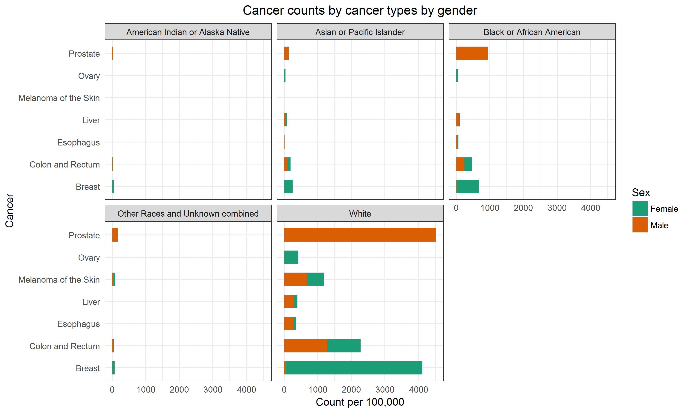
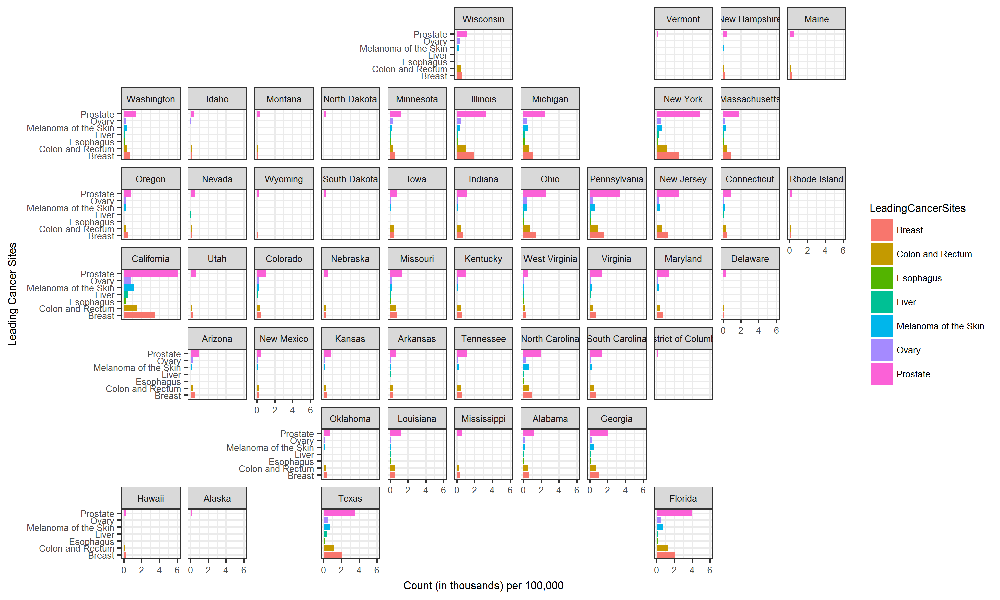
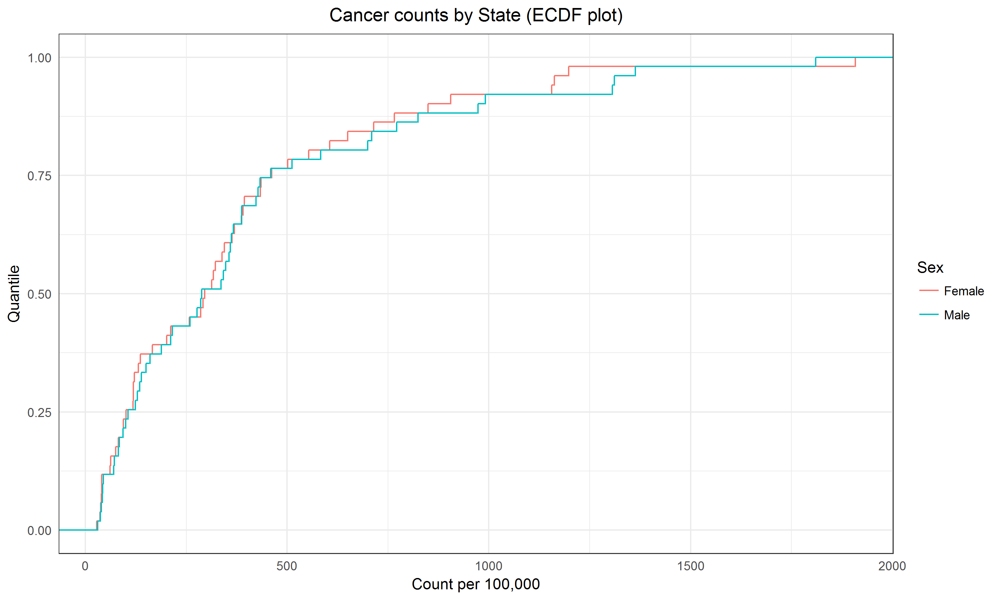

```{r setup, include=FALSE}
knitr::opts_chunk$set(echo = TRUE)
```

## Visualizations for CDC Cancer dataset

The following visualizations present the CDC cancer dataset for the years 1999 to 2012. The source of the data is https://drive.google.com/file/d/0B4RXVYeUUKitZUdYeFdhd2t0d0U/view.  

Each visualization attempts to bring out a different aspect of the provided data. A random sample of the dataset is provided below.  Important to note that all counts are per 100,000 people belonging to that demographic.
```{r echo=FALSE}
options(warn=-1)
suppressMessages(library(dplyr))
fname = 'USA_Cancer_Stats_1999_2012_CDC_orgSite_New.csv'
df = read.csv(fname)
df = df %>% 
     select(LeadingCancerSites, AgeGroupCode, Sex, Race, Count, State) %>%
     sample_n(size=5)

if(NROW(df) != 0)
{
  knitr::kable(df, caption="CDC cancer dataset 1999-2012", 
               format="markdown", row.names=FALSE)
}
```

### A note about methodology used
Several visualizations presented here do some form of aggregation (such as combine all occurances of Breast cancer for White population across all age groups), this is done by first adding the counts across the groups being aggregated and then dividing the aggregated count by the number of groups. This is done so that the aggregated count is also in same units i.e. per 100,000 people as the original counts being added together to calculate the aggregated counts. Therefore, all counts mentioned in this report, whether aggregated or available as-is from the dataset are per 100,000.  

### Visualization 1 (Python, seaborn): Cancer type counts by Race 
The following visualization created in Python using the Seaborn library shows cancer counts for the state of California for each cancer type (location) by Race. 

From the visualization it appears that cancer occurances for the "White" population are highest and cancer counts for "American Indians and Alaska Natives" are the lowest. Breast cancer and prostate cancer are the two most common cancer types and this is true for White, African American or Black and Asian or Pacific Islander populations.

```{r, out.width = "550px", echo=FALSE}
#have to do this image embedding in a round about way
#to get control of image size, the default 6x4 doesnt work very well
#for this image
knitr::include_graphics("race_cancer_grouped.png")
```

### Visualization 2 (Python plotly, desktop style): Cancer type counts by Race 
The following visualization created in Python using the Plotly Dash library shows cancer data amongst the Black or African American population summarized across all U.S. states (in the dataset). The visualization explores counts for each cancer type in each age group. A mouseover an individual bubble provides the name of the cancer type and age group alongwith the cancer count as a tooltip.    

Each bubble in the visualization represents a cancer type - age group tuple and the size of the bubble is a measure of the population impacted by that cancer type in that age group. For example, Prostate cancer in the 65 to 69 age group has the highest occurance as compared to any cancer in any age group in the Black or African American population. After prostate cancer, the next highest occurance is of breast cancer. This is consistent with similar data available for other demogrpahics (refer to the first visualization in this report).  

This visualization is created in python using plotly dash. When the python script is run it creates a visualization which can be seen in a web browser by going to the http://127.0.0.1:8050/ link. A screenshot of the visualization is presented here (to see mouseover, would need to run the python code).  


\  

### Visualization 3 (R, ggplot): Cancer counts by age group across Race
The following visualization is created in R using the ggplot2 library. This visualization shows the cancer count by age group (aggregated across all cancer types) for each Race.  
From the visualization it is evident that the largest occurance of cancer (by count per 100,000 people) is in the White population and it increases with age i.e. senior population is more susceptible to cancer especially the age group of 60-64, 65-69 and 70-74. This pattern of high cancer rate with age also holds for other races, and is clearly seen in the Black or African American population as well. 


\  

### Visualization 4 (R, ggplot): 
The following visualization is created in R using the ggplot2 library. This visualization shows the cancer count by cancer type for each Race for both males and females.  

The common themes that is evident in almost every visualization is that the counts are highest for the white population. From the visualization it is clear that prostate cancer occurance is highest in white males while breast cancer occurance is highest in white females. 



\  


### Visualization 5 (R, ggplot): 
The following visualization is created in R using the ggplot2 library using the geofacet package. This visualization shows the cancer count by cancer type for each U.S state for which the data is available in the CDC dataset. The plot is "geofacet'ed" in that each state is shown on the map of the U.S. and the bar plots for a state are contained in that state as seen on the map of the U.S. Geofacet'ing adds a spectral dimension to the visualization.  

From the visualization that California on the west coast and New York and Massachusetts on the west coast have the highest cancer occurances almost across all cancer types. In the south Florida and Texas exhibit high cancer occurances.    



\  

### Visualization 6 (R, ggplot): 
The following visualization is created in R using the ggplot2 library. This visualization shows the cancer count summarized across all cancer type for each state. The counts are plotted as empircal cumulative distrubtion function (ECDF) to get an overall sense of cancer occurances across states. Two separate ECDFs are shown, one more males and one for females. 

From the ECDF plot it is clear that the cancer counts in at least half of the U.S. states are at least 300 per 100,000 people. This is true for both males and females.  

Another interesting observation from this data is that the cancer counts for males and females start diverging after around the 76th percentile with cancer counts for males being higher than females. What this implies is that for states such as California, New York, Florida and Texas which have very high cancer rates the cancer rates in males is significantly higher than cancer rates in females. This assertion is supported by the geofacet'ed chart presented earlier which shows that in these states the counts for prostate cancer (which occurs almost exclusively in males) are extremely high.



\  

