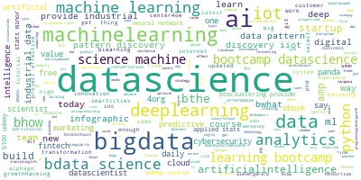
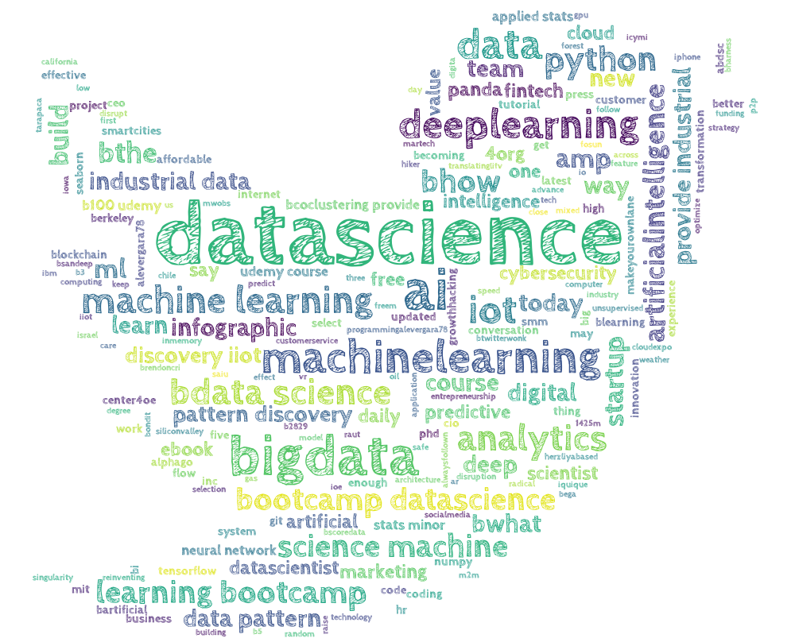
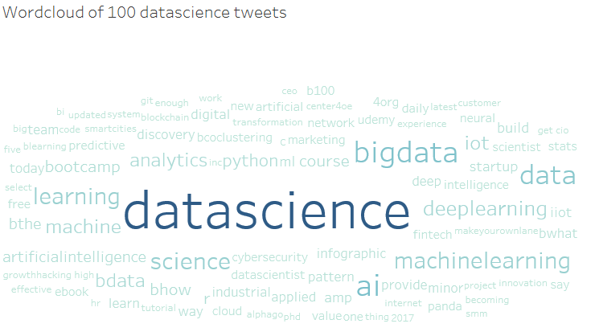
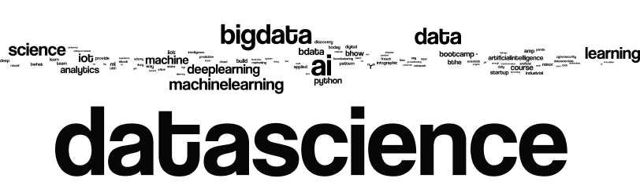

```{r setup, include=FALSE}
knitr::opts_chunk$set(echo = TRUE)
```

## Wordcloud from Twitter data
The tweets.py program was run to pull data from twitter for a user provider #hashtag and number of tweets and then generate a wordcloud after cleaning and tokenizing the tweet data. The program takes command line arguments, but if no arguments are provided it downloads 30 tweets for #ggplot2. A maximum of 30 tweets are allowed, if the user provides any number greater than 30 then the program automatically clamps it at 30.

Following is a sample invocation of the program.  
<b>python tweets.py  --hashtag=datascience --count=30</b>

Note that the leading # for the hashtag argument is optional, the program automatically adds it if the user does not provide it.

The following sections show wordcloud for tweets with #datascience. Note that a 100 tweets were downloaded by changing the code temporarily just to get a good wordcloud visualization. Also, retweets were excluded from the twitter query.

### Wordclouds made in Python
Two wordclouds were created in Python. The screenshots are provided below.




\


### Wordcloud using Tableau
Wordcloud for the same data made using Tableau. See <https://public.tableau.com/profile/amit.arora8367#!/vizhome/datasciencewordcloud/Sheet1>.



\


### Wordcloud using Wordle
Wordcloud for the same data made using Wordle.


\


## File list
Quick list for what is what.

1. tweets.py: this is the python code for the entire part 1 homework.
2. tweets_for_#hashtag_datascience.txt: raw text for tweets as received, no cleaning performed.
3. word_freq_for_datascience.txt: word frequency distribution from the "cleaned" tweet data. The cleaning process involved custom stopwords (hardcoded, also through stopwords.txt), standard stopwords provided by NLTK, removing URLs from tweet text, removing words which did not contain any number or letters, removing punctuation characters and finally lemmaization. This file is used for Wordle.
4. word_freq_for_datascience_tableau.txt: same as word_freq_for_datascience.txt except this has a header row. Wordle does not work with a header row, Tableau does not work without it.
5. *.png: wordcloud png files.
